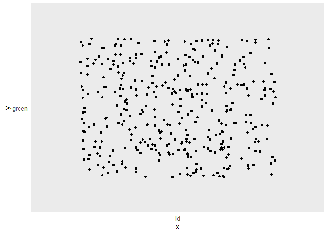

hw03
================
Diego A. Dulanto
2/18/2021

# Homework 03

``` r
library(naniar)
library(scales)
library(gridExtra)
library(tidyverse)
```

    ## -- Attaching packages --------------------------------------- tidyverse 1.3.0 --

    ## v ggplot2 3.3.3     v purrr   0.3.4
    ## v tibble  3.0.6     v dplyr   1.0.4
    ## v tidyr   1.1.2     v stringr 1.4.0
    ## v readr   1.4.0     v forcats 0.5.1

    ## -- Conflicts ------------------------------------------ tidyverse_conflicts() --
    ## x readr::col_factor() masks scales::col_factor()
    ## x dplyr::combine()    masks gridExtra::combine()
    ## x purrr::discard()    masks scales::discard()
    ## x dplyr::filter()     masks stats::filter()
    ## x dplyr::lag()        masks stats::lag()

``` r
library(patchwork)
```

    ## Warning: package 'patchwork' was built under R version 4.0.4

You will analyze data looking at the relationship between **green
reputation** and three personality traits–**compassion**, **intellectual
curiosity**, and **openness to experiences**. The dataset includes data
from **students** and **non-students**.

``` r
dictionary <- readr::read_csv("green_dictionary.csv")
```

    ## 
    ## -- Column specification --------------------------------------------------------
    ## cols(
    ##   Item = col_character(),
    ##   Content = col_character(),
    ##   Options = col_character(),
    ##   Keying = col_double()
    ## )

``` r
green_data <- readr::read_csv("green_data.csv")
```

    ## 
    ## -- Column specification --------------------------------------------------------
    ## cols(
    ##   .default = col_double(),
    ##   id = col_character()
    ## )
    ## i Use `spec()` for the full column specifications.

For your assignment, do the following.

1.  Inspect the item responses (e.g., with graphs or by summarizing
    distinct values). Is anything unusual?

``` r
green_data %>%
  summarise(across(c(green1:student),
                   list(
                     Max = ~ max(.x, na.rm = TRUE),
                     Min = ~ min(.x, na.rm = TRUE)
                   )))
```

    ## # A tibble: 1 x 72
    ##   green1_Max green1_Min green2_Max green2_Min green3_Max green3_Min green4_Max
    ##        <dbl>      <dbl>      <dbl>      <dbl>      <dbl>      <dbl>      <dbl>
    ## 1          5          1          5          1          5          1          5
    ## # ... with 65 more variables: green4_Min <dbl>, green5_Max <dbl>,
    ## #   green5_Min <dbl>, comp1_Max <dbl>, comp1_Min <dbl>, comp2_Max <dbl>,
    ## #   comp2_Min <dbl>, comp3_Max <dbl>, comp3_Min <dbl>, comp4_Max <dbl>,
    ## #   comp4_Min <dbl>, comp5_Max <dbl>, comp5_Min <dbl>, comp6_Max <dbl>,
    ## #   comp6_Min <dbl>, comp7_Max <dbl>, comp7_Min <dbl>, comp8_Max <dbl>,
    ## #   comp8_Min <dbl>, comp9_Max <dbl>, comp9_Min <dbl>, comp10_Max <dbl>,
    ## #   comp10_Min <dbl>, intel1_Max <dbl>, intel1_Min <dbl>, intel2_Max <dbl>,
    ## #   intel2_Min <dbl>, intel3_Max <dbl>, intel3_Min <dbl>, intel4_Max <dbl>,
    ## #   intel4_Min <dbl>, intel5_Max <dbl>, intel5_Min <dbl>, intel6_Max <dbl>,
    ## #   intel6_Min <dbl>, intel7_Max <dbl>, intel7_Min <dbl>, intel8_Max <dbl>,
    ## #   intel8_Min <dbl>, intel9_Max <dbl>, intel9_Min <dbl>, intel10_Max <dbl>,
    ## #   intel10_Min <dbl>, open1_Max <dbl>, open1_Min <dbl>, open2_Max <dbl>,
    ## #   open2_Min <dbl>, open3_Max <dbl>, open3_Min <dbl>, open4_Max <dbl>,
    ## #   open4_Min <dbl>, open5_Max <dbl>, open5_Min <dbl>, open6_Max <dbl>,
    ## #   open6_Min <dbl>, open7_Max <dbl>, open7_Min <dbl>, open8_Max <dbl>,
    ## #   open8_Min <dbl>, open9_Max <dbl>, open9_Min <dbl>, open10_Max <dbl>,
    ## #   open10_Min <dbl>, student_Max <dbl>, student_Min <dbl>

``` r
filter(green_data, id == 5549) #I'm checking for duplicate data
```

    ## # A tibble: 2 x 37
    ##   id    green1 green2 green3 green4 green5 comp1 comp2 comp3 comp4 comp5 comp6
    ##   <chr>  <dbl>  <dbl>  <dbl>  <dbl>  <dbl> <dbl> <dbl> <dbl> <dbl> <dbl> <dbl>
    ## 1 5549       3      4      4      4      3     4     2     4     4     4     4
    ## 2 5549       4      2      4      3      4     4     5     4     5     5     1
    ## # ... with 25 more variables: comp7 <dbl>, comp8 <dbl>, comp9 <dbl>,
    ## #   comp10 <dbl>, intel1 <dbl>, intel2 <dbl>, intel3 <dbl>, intel4 <dbl>,
    ## #   intel5 <dbl>, intel6 <dbl>, intel7 <dbl>, intel8 <dbl>, intel9 <dbl>,
    ## #   intel10 <dbl>, open1 <dbl>, open2 <dbl>, open3 <dbl>, open4 <dbl>,
    ## #   open5 <dbl>, open6 <dbl>, open7 <dbl>, open8 <dbl>, open9 <dbl>,
    ## #   open10 <dbl>, student <dbl>

``` r
dictionary %>%
  summarize(dictionary)
```

    ## # A tibble: 36 x 4
    ##    Item   Content                                         Options         Keying
    ##    <chr>  <chr>                                           <chr>            <dbl>
    ##  1 green1 Overall, I am regarded as an environmentally c~ 1-5; SD, D, NA~      1
    ##  2 green2 I am not particularly known for protecting the~ 1-5; SD, D, NA~     -2
    ##  3 green3 My friends know I enjoy nature.                 1-5; SD, D, NA~      1
    ##  4 green4 I have a reputation for living in harmony with~ 1-5; SD, D, NA~      1
    ##  5 green5 Among people I know, I seem to be the one most~ 1-5; SD, D, NA~      1
    ##  6 comp1  I feel others' emotions.                        1-5; SD, D, NA~      1
    ##  7 comp2  I inquire about others' well-being.             1-5; SD, D, NA~      1
    ##  8 comp3  I sympathize with others' feelings.             1-5; SD, D, NA~      1
    ##  9 comp4  I take an interest in other people's lives.     1-5; SD, D, NA~      1
    ## 10 comp5  I like to do things for others.                 1-5; SD, D, NA~      1
    ## # ... with 26 more rows

``` r
green_data %>%
  ggplot() +
  geom_jitter(aes(x = "id", y = "green"))
```

<!-- -->

``` r
# There are -99s in the data that needs to be recoded

recoded_green <-
  green_data %>%
  na_if(-99) %>%
  mutate(student = recode(student, "1" = "nonstudent", "2" = "student"))
```

1.  Compute total scores for the four scales. Recode variables as
    needed.

``` r
reversed <- dictionary %>%
  filter(Keying == -1 | Keying == -2) %>%
  pull(Item)


reversed_green <- recoded_green %>%
  mutate(across(all_of(reversed),
                ~ recode(
                  .x,
                  "5" = 1,
                  "4" = 2,
                  "3" = 3,
                  "2" = 4,
                  "1" = 5
                )))

total_green <-
  reversed_green %>%
  rowwise() %>%
  mutate(
    green_tot = mean(c_across(green1:green5)),
    comp_tot = mean(c_across(comp1:comp10)),
    intel_tot = mean(c_across(intel1:intel10)),
    open_tot = mean(c_across(open1:open10))
  ) %>%
  na.omit() %>%
  select(id, student, green_tot, comp_tot, intel_tot, open_tot)
```

1.  Rescale the variables so that they go from 0-100 instead of the
    original range.Name the rescaled variables `*_pomp`.

``` r
rescaled_green <-
  total_green %>%
  mutate(
    green_pomp = rescale(green_tot,
                         to = c(0, 100),
                         from = c(1, 5)),
    comp_pomp = rescale(comp_tot,
                        to = c(0, 100),
                        from = c(1, 5)),
    intel_pomp = rescale(intel_tot,
                         to = c(0, 100),
                         from = c(1, 5)),
    open_pomp = rescale(open_tot,
                        to = c(0, 100),
                        from = c(1, 5))
  ) %>%
  select(id,
         student,
         green_pomp,
         comp_pomp,
         intel_pomp,
         open_pomp)
```

1.  Make plots that illustrate the distributions of the 4 POMP-scored
    variables.

``` r
green_histo <- ggplot(rescaled_green) +
  aes(x = green_pomp) +
  geom_histogram(fill = "red",
                 bins = 25) +
  theme_classic()

intel_histo  <- ggplot(rescaled_green) +
  aes(x = intel_pomp) +
  geom_histogram(fill = "green",
                 bins = 25) +
  theme_classic()

comp_histo <- ggplot(rescaled_green) +
  aes(x = comp_pomp) +
  geom_histogram(fill = "blue",
                 bins = 25) +
  theme_classic()

open_histo <- ggplot(rescaled_green) +
  aes(x = open_pomp) +
  geom_histogram(fill = "purple",
                 bins = 25) +
  theme_classic()

wrap_plots(green_histo,
             comp_histo,
             intel_histo,
             open_histo)
```


The graphs show that these four variables have relatively normal
distribution. The data also tells us that, for comp and open, their
distribution are slightly skewed left.

1.  Make scatterplots showing the relationships between **green
    reputation** and each personality trait. Include trend lines for
    **students** and **non-students**. What do these plots show?

``` r
comp_scatter <-
  ggplot(rescaled_green,
         aes(x = comp_pomp,
             y = green_pomp,
             color = student)) + 
  theme_bw() +
  geom_point(alpha = .5) +
  geom_smooth(aes(group = student)) 

intel_scatter <-
  ggplot(rescaled_green,
         aes(x = intel_pomp,
             y = green_pomp,
             color = student)) +
  theme_bw() +
  geom_point(alpha = .5) +
  geom_smooth(aes(group = student))

open_scatter <-
  ggplot(rescaled_green, aes(x = open_pomp,
                             y = green_pomp,
                             color = student)) +
  theme_bw() +
  geom_point(alpha = .5) +
  geom_smooth(aes(group = student))

grid.arrange(comp_scatter,
             intel_scatter,
             open_scatter)
```

    ## `geom_smooth()` using method = 'loess' and formula 'y ~ x'
    ## `geom_smooth()` using method = 'loess' and formula 'y ~ x'
    ## `geom_smooth()` using method = 'loess' and formula 'y ~ x'


Intellect and openness have a stronger effect on the green reputation
for students. The relationship between personality traits and green
reputation correlate with students and non-students. The higher the
score on compassion, intellect, and openness, the higher the green
reputation.

1.  Compare **green reputation** for students and non-students using a
    **rainfall plot** (bar + density + data points).

``` r
ggplot(rescaled_green) +
  aes(x = green_pomp,
      y = student,
      color = student,
      fill = student) +
  geom_jitter(width = 0, height = .1, alpha = .4) +
  guides(color = guide_none(), fill = guide_none()) +
  ggdist::stat_sample_slabinterval(
    color = "black",
    height = .4, 
    alpha = .5, 
    position = position_nudge(y = .1)
  ) +
  theme_classic()
```


Non-students have a higher count on the green reputation scale than the
students. Non-students have a slightly wider distribution on the green
reputation scale.

1.  Compute a summary table of means, SDs, medians, minima, and maxima
    for the four total scores for students and non-students.

``` r
rescaled_green %>%
  select(student, green_pomp,
         comp_pomp,
         intel_pomp,
         open_pomp) %>%
  group_by(student) %>%
  summarize(across(
    c(green_pomp,
      comp_pomp,
      intel_pomp,
      open_pomp),
    list(
      mean = ~ mean(.x, na.rm = TRUE),
      sd = ~ sd(.x, na.rm = TRUE),
      med = ~ median(.x, na.rm = TRUE),
      min = ~ min(.x, na.rm = TRUE),
      max = ~ max(.x, na.rm = TRUE)
    )
  ))
```

    ## # A tibble: 2 x 21
    ##   student green_pomp_mean green_pomp_sd green_pomp_med green_pomp_min
    ## * <chr>             <dbl>         <dbl>          <dbl>          <dbl>
    ## 1 nonstu~            58.4          16.7            60            10.0
    ## 2 student            56.6          17.1            55.           15. 
    ## # ... with 16 more variables: green_pomp_max <dbl>, comp_pomp_mean <dbl>,
    ## #   comp_pomp_sd <dbl>, comp_pomp_med <dbl>, comp_pomp_min <dbl>,
    ## #   comp_pomp_max <dbl>, intel_pomp_mean <dbl>, intel_pomp_sd <dbl>,
    ## #   intel_pomp_med <dbl>, intel_pomp_min <dbl>, intel_pomp_max <dbl>,
    ## #   open_pomp_mean <dbl>, open_pomp_sd <dbl>, open_pomp_med <dbl>,
    ## #   open_pomp_min <dbl>, open_pomp_max <dbl>

Non-students have a higher green reputation mean, lower standard
variance, higher median, and larger range in comparison with students.
Notably, non-students have a lower score on openness even though their
minimum score is much higher than students. Surprisingly, non-students
had a higher minimum score on all personality traits than students.
